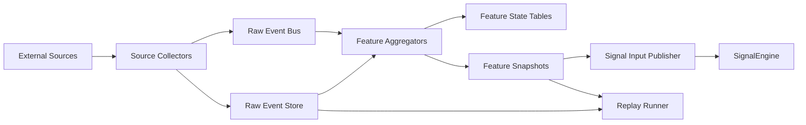
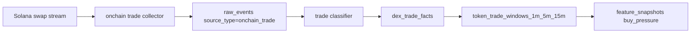
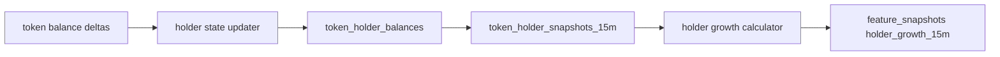
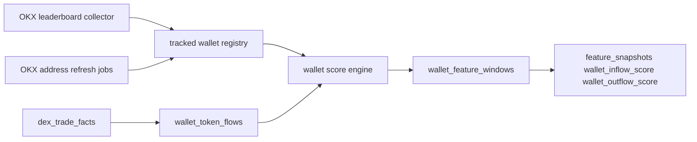
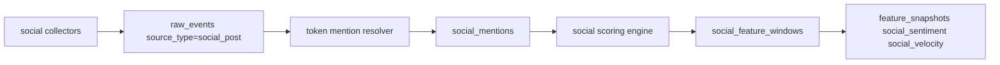
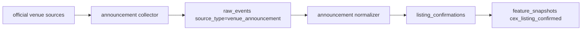
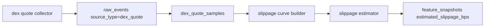

# Data Acquisition Implementation Plan

## 1. Purpose

This document defines the production-grade data acquisition and feature production layer for SignalEngine.

The current repository already has normalized event builders in:

- `sentinel/onchain_listener.py`
- `sentinel/wallet_tracker.py`
- `sentinel/social_listener.py`
- `sentinel/market_listener.py`

Those files are useful as normalization boundaries and test fixtures, but they are not production collectors. They do not currently fetch external data, maintain rolling windows, deduplicate source events, or publish feature-quality metadata.

This document specifies the production chain needed to generate reliable versions of:

- `buy_pressure`
- `holder_growth_15m`
- `wallet_inflow_score`
- `wallet_outflow_score`
- `social_sentiment`
- `social_velocity`
- `cex_listing_confirmed`
- `estimated_slippage_bps`

## 2. Design Goals

The feature production layer must satisfy all of the following:

- reliable replay from raw source events
- explicit event-time windowing
- deterministic, versioned feature formulas
- source deduplication and idempotent ingestion
- freshness and quality metadata on every feature
- degraded-mode behavior without silent zeroing
- source-level lag, error-rate, and staleness monitoring
- separation between data collection, feature computation, and signal scoring

## 3. Production Architecture



### 3.1 Layer Responsibilities

`Source Collectors`
- connect to RPC, APIs, feeds, and crawlers
- emit raw source events with source metadata
- checkpoint cursors and backfill gaps

`Raw Event Bus`
- carry low-latency events for incremental aggregation
- preserve ordering keys and dedupe keys

`Raw Event Store`
- persist replayable source payloads
- allow backfills and reconciliation

`Feature Aggregators`
- compute rolling token-level features
- maintain state tables and feature windows
- emit feature snapshots with quality metadata

`Signal Input Publisher`
- publish only validated feature snapshots to the signal pipeline
- reject stale or incomplete snapshots in live mode

## 4. Canonical Storage Layout

The production chain should use one shared raw-event table plus specialized derived tables.

### 4.1 Shared Raw Event Table

Table: `raw_events`

| Column | Type | Notes |
|---|---|---|
| `id` | UUID PK | internal event id |
| `source_type` | TEXT | `onchain_trade`, `wallet_flow`, `social_post`, `venue_announcement`, `dex_quote` |
| `source_name` | TEXT | connector name such as `solana_ws`, `jupiter_quote`, `twitter_api` |
| `source_event_id` | TEXT | upstream unique id or derived idempotency key |
| `chain` | TEXT NULL | chain if applicable |
| `token` | TEXT NULL | token symbol or canonical asset id |
| `observed_at` | TIMESTAMPTZ | source event time |
| `ingested_at` | TIMESTAMPTZ | collector ingest time |
| `cursor` | TEXT NULL | slot, block, page cursor, announcement cursor |
| `payload` | JSONB | raw upstream payload |
| `payload_hash` | TEXT | dedupe hash for content validation |
| `replayable` | BOOLEAN | should always be true for production inputs |
| `schema_version` | TEXT | source payload contract version |
| `created_at` | TIMESTAMPTZ | row creation time |

Indexes:
- unique on `(source_name, source_event_id)`
- index on `(source_type, observed_at)`
- index on `(chain, token, observed_at)`

### 4.2 Feature Snapshot Table

Table: `feature_snapshots`

| Column | Type | Notes |
|---|---|---|
| `id` | UUID PK | snapshot id |
| `chain` | TEXT | chain |
| `token` | TEXT | token |
| `feature_name` | TEXT | feature key |
| `feature_value` | DOUBLE PRECISION | normalized or boolean numeric output |
| `window_name` | TEXT | `1m`, `5m`, `15m`, `event`, `latest` |
| `as_of` | TIMESTAMPTZ | event-time watermark |
| `sample_count` | INTEGER | number of source samples used |
| `freshness_seconds` | DOUBLE PRECISION | computed at publication time |
| `quality_flag` | TEXT | `ok`, `stale`, `low_sample`, `backfilled`, `degraded` |
| `formula_version` | TEXT | feature formula version |
| `inputs` | JSONB | compact diagnostic summary |
| `created_at` | TIMESTAMPTZ | row creation time |

Indexes:
- unique on `(chain, token, feature_name, window_name, as_of, formula_version)`
- index on `(chain, token, as_of desc)`

### 4.3 Feature Quality Table

Table: `feature_quality`

| Column | Type | Notes |
|---|---|---|
| `id` | UUID PK | quality record id |
| `chain` | TEXT | chain |
| `token` | TEXT | token |
| `feature_name` | TEXT | feature key |
| `as_of` | TIMESTAMPTZ | evaluation time |
| `freshness_seconds` | DOUBLE PRECISION | freshness |
| `source_lag_seconds` | DOUBLE PRECISION | max lag among dependencies |
| `missing_sources` | JSONB | missing source names |
| `degraded_reason` | TEXT NULL | explicit degraded reason |
| `created_at` | TIMESTAMPTZ | row creation time |

## 5. Field-Level Production Design

## 5.1 `buy_pressure`

### Source Definition

`buy_pressure` measures the share of DEX buy notional within a rolling trade window.

Formula:

$$
buy\_pressure = \frac{\sum buy\_notional\_usd}{\sum buy\_notional\_usd + \sum sell\_notional\_usd}
$$

Primary sources:
- Solana swap/log stream from RPC WebSocket or indexer
- token-side trade classification from pool or route metadata
- USD notional from quote or pool pricing data

### Production Flow



### Derived Tables

Table: `dex_trade_facts`

| Column | Type | Notes |
|---|---|---|
| `trade_id` | TEXT PK | deterministic key from tx hash and log index |
| `chain` | TEXT | chain |
| `token` | TEXT | token |
| `pool_address` | TEXT | pool or route anchor |
| `wallet_address` | TEXT NULL | taker wallet |
| `side` | TEXT | `buy` or `sell` |
| `token_amount` | DOUBLE PRECISION | token amount |
| `quote_amount_usd` | DOUBLE PRECISION | USD notional |
| `observed_at` | TIMESTAMPTZ | trade time |
| `source_event_id` | TEXT | links to `raw_events` |
| `classification_version` | TEXT | side inference version |

Table: `token_trade_windows`

| Column | Type | Notes |
|---|---|---|
| `chain` | TEXT | chain |
| `token` | TEXT | token |
| `window_name` | TEXT | `1m`, `5m`, `15m` |
| `window_end` | TIMESTAMPTZ | event-time window end |
| `buy_notional_usd` | DOUBLE PRECISION | rolling buy notional |
| `sell_notional_usd` | DOUBLE PRECISION | rolling sell notional |
| `trade_count` | INTEGER | sample count |
| `unique_wallets` | INTEGER | unique takers |
| `updated_at` | TIMESTAMPTZ | update time |

### Reliability Rules

- reject duplicate trades by `trade_id`
- cap single-wallet contribution in the window
- mark quality as `low_sample` if trade count is below threshold
- backfill missing slots before finalizing window output

## 5.2 `holder_growth_15m`

### Source Definition

`holder_growth_15m` measures change in unique funded token holders across a 15-minute event-time window.

Primary sources:
- token account balance deltas
- owner-address mapping for token accounts
- dust threshold policy per token
- OKX Token API holder statistics and Address Analysis API as secondary bootstrap and quality-check inputs

### Production Flow



### Derived Tables

Table: `token_holder_balances`

| Column | Type | Notes |
|---|---|---|
| `chain` | TEXT | chain |
| `token` | TEXT | token |
| `owner_address` | TEXT | owner wallet |
| `balance_raw` | NUMERIC | raw token units |
| `balance_normalized` | DOUBLE PRECISION | decimal-adjusted balance |
| `is_holder` | BOOLEAN | above dust threshold |
| `last_observed_at` | TIMESTAMPTZ | event time |
| `last_source_event_id` | TEXT | source linkage |

Table: `token_holder_snapshots`

| Column | Type | Notes |
|---|---|---|
| `chain` | TEXT | chain |
| `token` | TEXT | token |
| `snapshot_at` | TIMESTAMPTZ | event-time snapshot |
| `holder_count` | INTEGER | unique funded holders |
| `formula_version` | TEXT | holder definition version |
| `created_at` | TIMESTAMPTZ | row creation time |

### Reliability Rules

- deduplicate owner address across token accounts
- ignore dust-level balances
- compute on incremental state, not full rescans
- mark as `degraded` if holder-state lag exceeds threshold

## 5.3 `wallet_inflow_score` and `wallet_outflow_score`

### Source Definition

These scores measure weighted smart-wallet buying and selling pressure for a token.

Primary sources:
- OKX Strategy API leaderboard for candidate smart-wallet discovery
- tracked wallet registry as the canonical internal registry
- wallet trade facts derived from on-chain trades
- wallet weighting model and label set
- OKX Address Analysis API, Balance API, and Tx History API for address enrichment and refresh

### Production Flow



### Derived Tables

Table: `tracked_wallet_registry`

| Column | Type | Notes |
|---|---|---|
| `wallet_address` | TEXT PK | wallet |
| `chain` | TEXT | chain |
| `wallet_class` | TEXT | `smart_money`, `mm`, `kol`, `watchlist` |
| `weight` | DOUBLE PRECISION | wallet influence weight |
| `status` | TEXT | `active` or `disabled` |
| `source` | TEXT | `okx_leaderboard`, `manual`, `internal_discovery` |
| `source_metadata` | JSONB | source wallet type, timeframe, sort key, rank, filters |
| `version` | TEXT | registry version |
| `discovered_at` | TIMESTAMPTZ | first seen time |
| `last_seen_at` | TIMESTAMPTZ | most recent upstream refresh |
| `updated_at` | TIMESTAMPTZ | update time |

### OKX Integration Rules

- use OKX Strategy API leaderboard as a candidate discovery source, not as the canonical feature output
- persist upstream provenance so each tracked wallet can be audited back to the exact leaderboard pull
- refresh candidate wallets across multiple `timeFrame`, `sortBy`, and `walletType` combinations to avoid single-view bias
- keep `wallet_token_flows` and feature windows derived from our own chain-level trade facts so replay stays deterministic
- degrade quality when OKX refresh is stale, but do not silently drop existing registry members without explicit expiry policy

Table: `wallet_token_flows`

| Column | Type | Notes |
|---|---|---|
| `flow_id` | TEXT PK | deterministic flow key |
| `chain` | TEXT | chain |
| `token` | TEXT | token |
| `wallet_address` | TEXT | tracked wallet |
| `direction` | TEXT | `inflow` or `outflow` |
| `notional_usd` | DOUBLE PRECISION | USD notional |
| `trade_count` | INTEGER | count merged into row |
| `observed_at` | TIMESTAMPTZ | event time |
| `source_trade_id` | TEXT | source trade link |

Table: `wallet_feature_windows`

| Column | Type | Notes |
|---|---|---|
| `chain` | TEXT | chain |
| `token` | TEXT | token |
| `window_name` | TEXT | `5m`, `15m` |
| `window_end` | TIMESTAMPTZ | event-time window end |
| `weighted_inflow_usd` | DOUBLE PRECISION | weighted sum |
| `weighted_outflow_usd` | DOUBLE PRECISION | weighted sum |
| `active_wallet_count` | INTEGER | unique tracked wallets |
| `registry_version` | TEXT | wallet registry version |
| `updated_at` | TIMESTAMPTZ | update time |

### Reliability Rules

- registry must be versioned and auditable
- merge bursty wallet actions into short buckets to reduce spam
- separate transfer noise from trade-derived flows
- mark feature as `low_sample` when active tracked-wallet count is too small

## 5.4 `social_sentiment` and `social_velocity`

### Source Definition

`social_sentiment` captures weighted polarity for token mentions.

`social_velocity` captures mention acceleration relative to token baseline.

Primary sources:
- X, Telegram, Discord, RSS, news feed collectors
- mention resolution and token alias matching
- sentiment model output and author trust score

### Production Flow



### Derived Tables

Table: `social_posts_raw`

| Column | Type | Notes |
|---|---|---|
| `post_id` | TEXT PK | platform post id |
| `platform` | TEXT | `x`, `telegram`, `discord`, `rss` |
| `author_id` | TEXT NULL | author id |
| `published_at` | TIMESTAMPTZ | post time |
| `content` | TEXT | normalized text |
| `engagement` | JSONB | likes, reposts, replies |
| `source_event_id` | TEXT | links to `raw_events` |

Table: `social_mentions`

| Column | Type | Notes |
|---|---|---|
| `mention_id` | UUID PK | mention row id |
| `platform` | TEXT | platform |
| `token` | TEXT | resolved token |
| `chain` | TEXT NULL | chain if known |
| `post_id` | TEXT | source post id |
| `author_weight` | DOUBLE PRECISION | trust or relevance weight |
| `sentiment_score` | DOUBLE PRECISION | model output |
| `is_duplicate` | BOOLEAN | duplicate marker |
| `published_at` | TIMESTAMPTZ | event time |
| `resolver_version` | TEXT | mention resolver version |

Table: `social_feature_windows`

| Column | Type | Notes |
|---|---|---|
| `token` | TEXT | token |
| `chain` | TEXT NULL | chain if known |
| `window_name` | TEXT | `5m`, `15m`, `1h` |
| `window_end` | TIMESTAMPTZ | event-time window end |
| `mention_count` | INTEGER | unique mentions |
| `unique_author_count` | INTEGER | unique authors |
| `weighted_sentiment_sum` | DOUBLE PRECISION | weighted sum |
| `baseline_mentions` | DOUBLE PRECISION | trailing baseline |
| `velocity_score` | DOUBLE PRECISION | normalized velocity |
| `updated_at` | TIMESTAMPTZ | update time |

### Reliability Rules

- dedupe reposts and copy-paste spam
- keep platform-level scores before merged score
- degrade rather than zero when source APIs are rate limited
- keep mention resolver versioned and auditable

## 5.5 `cex_listing_confirmed`

### Source Definition

This field is strictly for confirmed official listing events.

It must not be inferred from rumor alone.

Primary sources:
- exchange announcement pages
- exchange RSS feeds
- official verified venue posts

### Production Flow



### Derived Tables

Table: `venue_announcements_raw`

| Column | Type | Notes |
|---|---|---|
| `announcement_id` | TEXT PK | deterministic id |
| `venue` | TEXT | exchange |
| `source_url` | TEXT | source URL |
| `published_at` | TIMESTAMPTZ | source publish time |
| `title` | TEXT | normalized title |
| `content` | TEXT | normalized content |
| `source_event_id` | TEXT | raw event linkage |

Table: `listing_confirmations`

| Column | Type | Notes |
|---|---|---|
| `id` | UUID PK | row id |
| `venue` | TEXT | exchange |
| `token` | TEXT | token |
| `chain` | TEXT NULL | chain if known |
| `confirmed` | BOOLEAN | official confirmation state |
| `confidence` | DOUBLE PRECISION | should be 1.0 for official confirms |
| `announcement_url` | TEXT | supporting URL |
| `confirmed_at` | TIMESTAMPTZ | confirm time |
| `parser_version` | TEXT | parser version |

### Reliability Rules

- official sources only may set `confirmed = true`
- retain `cex_rumor_score` as a separate non-confirmation feature
- treat fetch failures as `unknown` or `stale`, not false

## 5.6 `estimated_slippage_bps`

### Source Definition

This field estimates execution cost in basis points for a target notional on the best current route.

Primary sources:
- aggregator quote API such as Jupiter
- route metadata and pool depth snapshots
- standard notional quote sampling or direct intent quote
- OKX Market Price API or Index Price API as secondary reference-mid and anomaly-detection inputs

### Production Flow



### Derived Tables

Table: `dex_quote_samples`

| Column | Type | Notes |
|---|---|---|
| `quote_id` | TEXT PK | deterministic quote id |
| `chain` | TEXT | chain |
| `token` | TEXT | token |
| `quote_notional_usd` | DOUBLE PRECISION | sampled notional |
| `expected_out_usd` | DOUBLE PRECISION | expected execution output |
| `reference_mid_usd` | DOUBLE PRECISION | reference fair value |
| `slippage_bps` | DOUBLE PRECISION | computed slippage |
| `route_summary` | JSONB | route diagnostics |
| `quoted_at` | TIMESTAMPTZ | quote time |
| `source_event_id` | TEXT | raw source link |

Table: `slippage_curves`

| Column | Type | Notes |
|---|---|---|
| `chain` | TEXT | chain |
| `token` | TEXT | token |
| `curve_as_of` | TIMESTAMPTZ | quote watermark |
| `sample_points` | JSONB | sampled notionals and bps |
| `curve_version` | TEXT | interpolation version |
| `freshness_seconds` | DOUBLE PRECISION | freshness |
| `updated_at` | TIMESTAMPTZ | update time |

### Reliability Rules

- use quote freshness thresholds in live mode
- fall back from direct quote to interpolated curve only when allowed
- store route diagnostics for replay and execution analysis
- never fill missing quote data with zero slippage

## 5.7 OKX Market API Fit

The OKX Market API can accelerate several acquisition surfaces, but it should not replace the internal raw-event spine where event-time reproducibility matters.

Recommended insertion points:
- Strategy API leaderboard: bootstrap and periodically refresh candidate smart-wallet addresses for `tracked_wallet_registry`
- Token API: bootstrap token metadata, holder statistics baselines, and token ranking discovery
- Address Analysis API: enrich tracked wallets with portfolio and holding context for weighting and freshness policies
- Balance API and Tx History API: backfill or refresh address state when direct chain collection is degraded
- Market Price API and Index Price API: provide reference prices, sanity bounds, and diagnostics for quote-derived slippage

Non-primary or unsupported insertion points:
- do not use OKX Market API as the primary source for `buy_pressure`; that must stay derived from trade-level chain facts
- do not use OKX Market API as the sole source for `holder_growth_15m`; holder state still needs incremental internal maintenance
- do not use OKX Market API as the sole source for `estimated_slippage_bps`; direct quote sampling remains the execution-facing truth
- `social_sentiment`, `social_velocity`, and `cex_listing_confirmed` still require separate social and official-announcement collectors

## 6. Publication Contract To SignalEngine

The production feature layer must publish a token-level bundle into the normalized signal input path.

Required publication payload:

```json
{
  "token": "BONK",
  "chain": "solana",
  "as_of": "2026-05-02T12:00:00Z",
  "features": {
    "buy_pressure": 0.81,
    "holder_growth_15m": 0.24,
    "wallet_inflow_score": 0.68,
    "wallet_outflow_score": 0.10,
    "social_sentiment": 0.42,
    "social_velocity": 0.57,
    "cex_listing_confirmed": false,
    "estimated_slippage_bps": 72.0
  },
  "quality": {
    "buy_pressure": "ok",
    "holder_growth_15m": "ok",
    "wallet_inflow_score": "low_sample",
    "social_sentiment": "degraded",
    "estimated_slippage_bps": "ok"
  },
  "formula_versions": {
    "buy_pressure": "bp_v1",
    "holder_growth_15m": "hg15_v1",
    "wallet_inflow_score": "wf_v1",
    "social_sentiment": "soc_v1",
    "estimated_slippage_bps": "slip_v1"
  }
}
```

Live signal processing should reject or degrade tokens when required inputs are stale beyond policy.

## 7. Reliability Controls

Every collector and feature builder must expose:

- source lag
- error rate
- reconnect count
- backfill count
- dropped-event count
- last successful watermark

Every feature snapshot must record:

- `freshness_seconds`
- `sample_count`
- `quality_flag`
- `formula_version`

Failure handling rules:

- missing source data must produce `degraded` or `stale`, not silent zeros
- replay must be able to reconstruct all feature snapshots from `raw_events`
- collectors must resume from persisted cursors after restart
- connectors must support backfill for source gaps

## 8. Implementation Sequence

### Phase A: Core Production Spine

- create collectors for on-chain trades, dex quotes, wallet flows, social posts, and venue announcements
- add `raw_events` persistence and idempotent write path
- add cursor checkpoint storage and replay hooks

### Phase B: On-Chain Trading Features

- implement `dex_trade_facts`
- implement `token_trade_windows`
- publish `buy_pressure`
- implement `dex_quote_samples` and `slippage_curves`
- publish `estimated_slippage_bps`

### Phase C: Holder And Wallet Intelligence

- implement `token_holder_balances`
- implement `token_holder_snapshots`
- publish `holder_growth_15m`
- implement `tracked_wallet_registry` with OKX leaderboard bootstrap and provenance
- implement `wallet_token_flows`
- add OKX address refresh jobs for tracked wallets
- publish `wallet_inflow_score` and `wallet_outflow_score`

### Phase D: Market And Social Features

- implement `venue_announcements_raw`
- implement `listing_confirmations`
- publish `cex_listing_confirmed`
- implement `social_posts_raw`
- implement `social_mentions`
- publish `social_sentiment` and `social_velocity`

## 9. Recommended Repository Additions

Recommended new modules:

- `sentinel/onchain_collector.py`
- `sentinel/dex_quote_collector.py`
- `sentinel/announcement_collector.py`
- `sentinel/social_collector.py`
- `sentinel/feature_aggregator.py`
- `infra/checkpoints.py`
- `infra/raw_event_store.py`
- `infra/feature_store.py`

Recommended new docs follow-up:

- runbook for collectors and backfills
- feature formula versioning policy
- wallet registry governance process
- announcement-source allowlist policy

## 10. Current Repository Gap Summary

The repository already has the signal, state, routing, risk, replay, and guarded live-control layers.

The missing production-grade component is the feature production layer between external data sources and `SignalEngine`.

That layer should be implemented before treating the current feature set as trustworthy live inputs.
