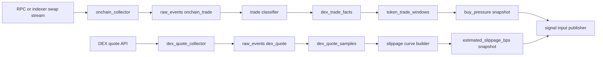

# On-Chain Feature Phase A Specification

This document is the first implementation slice for the production data acquisition plan.

Scope for this phase:

- `buy_pressure`
- `estimated_slippage_bps`

Out of scope for this phase:

- holder growth
- wallet registry scoring
- social collectors
- listing confirmation collectors

## 1. Objective

Build the first production-grade feature pipeline that turns raw on-chain trade and quote data into replayable, quality-aware feature snapshots.

Phase A should establish the ingestion spine and publish:

- `buy_pressure`
- `estimated_slippage_bps`

for the primary DEX chain and token universe.

## 2. Module Plan

Recommended first modules:

- `sentinel/onchain_collector.py`
- `sentinel/dex_quote_collector.py`
- `sentinel/feature_aggregator.py`
- `sentinel/onchain_feature_sync.py`
- `sentinel/onchain_live_sources.py`
- `infra/raw_event_store.py`
- `infra/checkpoints.py`
- `infra/feature_store.py`

## 3. Runtime Flow



## 4. Contracts

## 4.1 Raw On-Chain Trade Event

Source type: `onchain_trade`

Required payload fields:

```json
{
  "tx_hash": "...",
  "log_index": 12,
  "slot": 281234567,
  "pool_address": "...",
  "wallet_address": "...",
  "token": "BONK",
  "quote_asset": "USDC",
  "token_amount": 12345.0,
  "quote_amount": 1520.0,
  "quote_amount_usd": 1520.0,
  "side": "buy",
  "route_hint": "jupiter",
  "observed_at": "2026-05-02T12:00:00Z"
}
```

Current EVM live-source extensions:

- V2-style pool sources (`uniswap_v2`, `aerodrome`, `velodrome`) emit the same normalized trade contract above
- V3/CL pool sources (`uniswap_v3`, `aerodrome_cl`, `velodrome_cl`) also populate `route_diagnostics` with `sqrt_price_x96`, `liquidity`, and `tick`
- these diagnostics are optional and are preserved for replay and downstream quality inspection; the base feature formulas still rely on normalized notional and side

Implementation note:

- the current repository implementation accepts explicit `side` as the preferred deterministic classifier input
- if `side` is absent, classifier fallback requires signed token and quote amounts; otherwise the trade is rejected as `trade_side_unresolved`

Idempotency key:

`chain + tx_hash + log_index + token`

## 4.2 Raw Quote Event

Source type: `dex_quote`

Required payload fields:

```json
{
  "quote_request_id": "...",
  "chain": "solana",
  "token": "BONK",
  "quote_notional_usd": 5000.0,
  "expected_out_usd": 4860.0,
  "reference_mid_usd": 5000.0,
  "route_summary": {
    "provider": "jupiter",
    "hops": 2
  },
  "quoted_at": "2026-05-02T12:00:03Z"
}
```

Current EVM quote-source extensions:

- `zeroex` quote sources use GET request assembly and currently rely on DexScreener token USD prices
- `odos` quote sources use POST request assembly and can normalize token USD prices from provider-native payloads before falling back to DexScreener
- `route_summary` may include provider-specific diagnostics such as `fills`, `path_id`, or `gas_estimate`

Idempotency key:

`chain + token + quote_notional_usd + quoted_at + provider`

## 5. Derived State

## 5.1 `dex_trade_facts`

Minimum write API:

```python
def upsert_trade_fact(trade: DexTradeFact) -> None: ...
```

Responsibilities:

- infer trade side as `buy` or `sell`
- persist USD notional
- preserve source linkage to `raw_events`

## 5.2 `token_trade_windows`

Minimum write API:

```python
def update_trade_window(chain: str, token: str, observed_at: datetime) -> TokenTradeWindow: ...
```

Responsibilities:

- maintain rolling 1m, 5m, and 15m windows
- aggregate buy and sell notionals
- expose sample count and unique wallet count

## 5.3 `dex_quote_samples`

Minimum write API:

```python
def append_quote_sample(sample: DexQuoteSample) -> None: ...
```

Responsibilities:

- persist standard-notional quote samples
- preserve route diagnostics and freshness

## 5.4 `slippage_curves`

Minimum write API:

```python
def upsert_slippage_curve(chain: str, token: str, samples: list[DexQuoteSample]) -> SlippageCurve: ...
```

Responsibilities:

- interpolate or summarize quote samples
- return an estimate for configured notionals
- mark the curve stale when sample freshness is exceeded

## 6. Feature Publication

## 6.1 `buy_pressure`

Formula:

$$
buy\_pressure = \frac{buy\_notional\_usd}{buy\_notional\_usd + sell\_notional\_usd}
$$

Publication contract:

```json
{
  "feature_name": "buy_pressure",
  "window_name": "5m",
  "feature_value": 0.81,
  "sample_count": 42,
  "freshness_seconds": 3.1,
  "quality_flag": "ok",
  "formula_version": "bp_v1",
  "inputs": {
    "buy_notional_usd": 120000.0,
    "sell_notional_usd": 28000.0,
    "unique_wallets": 18
  }
}
```

Quality policy:

- `low_sample` when trade count < configured threshold
- `stale` when no fresh trades inside feature TTL
- `degraded` when source lag or backfill gap is active

## 6.2 `estimated_slippage_bps`

Formula:

$$
slippage\_bps = 10000 \times \frac{reference\_mid\_usd - expected\_out\_usd}{reference\_mid\_usd}
$$

Publication contract:

```json
{
  "feature_name": "estimated_slippage_bps",
  "window_name": "latest",
  "feature_value": 72.0,
  "sample_count": 3,
  "freshness_seconds": 2.4,
  "quality_flag": "ok",
  "formula_version": "slip_v1",
  "inputs": {
    "quote_notional_usd": 5000.0,
    "route_provider": "jupiter",
    "curve_version": "slippage_curve_v1"
  }
}
```

Quality policy:

- `stale` when latest usable quote exceeds freshness threshold
- `degraded` when interpolation fallback is used
- `degraded` when quote source is unavailable and no curve is usable

## 7. Config Additions

Recommended new settings groups:

```yaml
features:
  onchain:
    trade_windows: ["1m", "5m", "15m"]
    buy_pressure_primary_window: "5m"
    min_trade_count_for_buy_pressure: 10
    max_trade_lag_seconds: 30
  slippage:
    quote_notional_usd: [1000.0, 5000.0, 10000.0]

Current repository additions under `acquisition`:

```yaml
acquisition:
  evm_chains:
    base:
      chain_id: 8453
      provider: evm_quote_api
      api_provider: zeroex
  evm_routes:
    base_quote:
      source_type: quote
      quote_slippage_bps: 100
    ethereum_pool:
      source_type: pool_swap_trade
      pool_protocol: uniswap_v3
    arbitrum_transfer:
      source_type: transfer_trade
```

Operational note:

- live EVM sources still normalize into the same `onchain_trade` and `dex_quote` collector contracts, so replay and feature publication remain chain-agnostic at the aggregation layer

Live EVM acquisition notes:

- `acquisition.evm_routes.<name>.source_type=transfer_trade` for wallet-level ERC20 transfer inference
- `acquisition.evm_routes.<name>.source_type=pool_swap_trade` for Uniswap V2 style pool swap decoding
- `acquisition.evm_routes.<name>.source_type=quote` for 0x or Odos quote polling plus DexScreener price normalization
- `acquisition.evm_chains.<chain>` stores shared chain-level defaults such as `chain_id`, quote provider, and quote API URLs
- all EVM source entries resolve their RPC target from `venues.native_asset_rpc.<chain>`
    max_quote_age_seconds: 5
    allow_curve_fallback: true
acquisition:
  sync_interval_seconds: 5.0
  solana_wallet_trade:
    enabled: false
    wallet_address: null
    token: BONK
    token_mint: null
    quote_asset: USDC
    quote_mint: null
  jupiter_quote:
    enabled: false
    input_mint: null
    output_mint: null
```

## 8. Task Breakdown

### A1 Raw Event Backbone

- create `raw_events` persistence
- create collector checkpoint persistence
- add idempotent write helpers

### A2 On-Chain Trade Collector

- connect to primary trade source
- emit replayable on-chain trade events
- add reconnect and backfill behavior

### A3 Trade Classification And Windowing

- classify buy vs sell
- update `dex_trade_facts`
- update rolling trade windows
- publish `buy_pressure`

### A4 Quote Collector And Slippage Estimator

- sample standard notional quotes
- persist `dex_quote_samples`
- build `slippage_curves`
- publish `estimated_slippage_bps`

### A5 Validation And Replay

- replay trade events into the same feature outputs
- compare replayed snapshots with online outputs
- add diagnostics for stale, degraded, and low-sample states

Current implementation note:

- Phase A replay currently exists as a focused feature replay helper that rebuilds `buy_pressure` and `estimated_slippage_bps` from persisted `raw_events` into a clean repository and compares resulting latest snapshots
- Phase A now also includes a service orchestration entrypoint that runs collector -> aggregator -> publisher in one call and a worker CLI backfill mode for JSONL inputs
- the worker backfill mode can run once for batch imports or loop against an append-only JSONL file, relying on raw-event idempotency to avoid duplicate derived writes
- the repository now also includes a live acquisition mode with a Solana wallet-watch trade source and a Jupiter quote source

## 8.1 Current Live Sources

Current live-mode providers in this repository:

- `acquisition.solana_wallet_trade`: polls Solana RPC `getSignaturesForAddress` plus `getTransaction`, then normalizes wallet-level token and quote balance deltas into `onchain_trade`
- `acquisition.jupiter_quote`: polls Jupiter quote plus price endpoints, then normalizes the result into `dex_quote`

Operational constraint:

- the current Solana trade source is intentionally wallet-scoped, not chainwide, because Phase A is prioritizing deterministic normalized ingestion over full-chain swap decoding complexity

## 9. Acceptance Criteria

1. `buy_pressure` is produced from recorded trade facts, not hand-supplied payloads.
2. `estimated_slippage_bps` is produced from recorded quote samples or explicit curve fallback.
3. Both features publish freshness and quality metadata.
4. Both features are reproducible in replay from persisted raw inputs.
5. Collectors can restart from checkpoints without duplicating source events.
